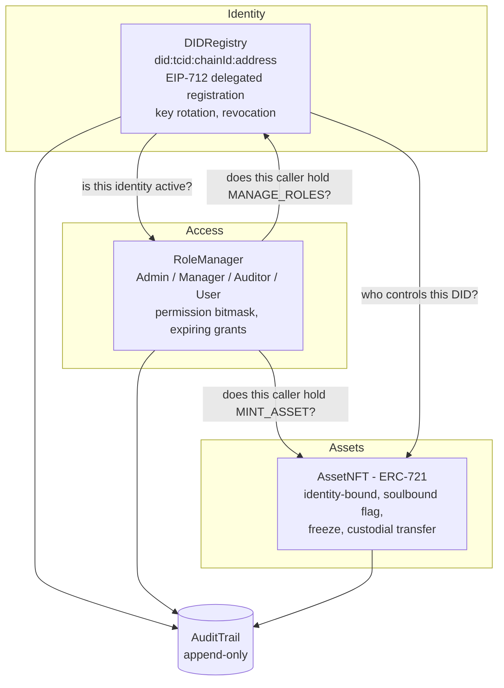

# TrustChain

A blockchain platform where **identity, access control, and asset ownership are the same
system**: every user is a decentralised identifier (DID), every permission is a role granted
to a DID, every asset is an NFT bound to a DID, and every privileged action lands in an
append-only audit trail in the same transaction that performs it.

Four Solidity contracts, 54 passing tests, a scripted end-to-end demo, and a web console
that shows the access-control rules being enforced live.

---

## Why the pieces are wired this way

Most "blockchain identity" projects bolt three separate systems together: an identity
registry, an `AccessControl` role list keyed by wallet address, and an ERC-721 collection.
The gaps between them are where the security goes:

| Gap in the naive design | What TrustChain does |
| --- | --- |
| Roles are granted to an **address**. Lose the key, lose the role; rotate the key, re-grant everything. | Roles are granted to a **DID**. `rotateController` moves the key; the roles and the assets stay with the identity. |
| Revoking a user means hunting down every role they hold. | Revoking the identity zeroes the permission mask in the same block — `permissionsOf` resolves through the DID every time, so there is no stale grant to clean up. |
| NFTs can be transferred to any address, including one with no identity behind it. | `_update` is overridden: a token can only ever land on an address controlling an active DID. This holds for `transferFrom`, `safeTransferFrom`, and operator-approved transfers alike. |
| An admin can mint an identity for someone who never asked for one. | `registerFor` requires an EIP-712 signature from the subject. The admin pays gas; the subject still consents cryptographically. |
| The audit log is written by the backend that also performs the action. | The audit entry is written *by the contract*, inside the same transaction. There is no code path that edits or deletes an entry, and only registered platform contracts can append. |

---

## Architecture



### Contracts

| Contract | Responsibility |
| --- | --- |
| [`DIDRegistry.sol`](contracts/DIDRegistry.sol) | Self-sovereign identifiers `did:tcid:<chainId>:<address>`, DID documents by URI, key rotation, permanent revocation, EIP-712 delegated registration. |
| [`RoleManager.sol`](contracts/RoleManager.sol) | RBAC bound to DIDs. Roles carry a permission bitmask; grants can expire; role hierarchy decides who may grant what. |
| [`AssetNFT.sol`](contracts/AssetNFT.sol) | ERC-721 (+ Enumerable, + URIStorage) where each token records the issuing identity, the holding identity, and a hash of the underlying document. |
| [`AuditTrail.sol`](contracts/AuditTrail.sol) | Append-only ledger of every privileged action, written by the platform contracts themselves. |

### Roles and permissions

Permissions are bits (`libraries/Permissions.sol`); a role is a mask of them, so
`permissionsOf(account)` is the union of the live roles behind that account's DID.

| Role | MANAGE_ROLES | REGISTER_IDENTITY | REVOKE_IDENTITY | MINT_ASSET | TRANSFER_ASSET | FREEZE_ASSET | BURN_ASSET | READ_AUDIT |
| --- | :-: | :-: | :-: | :-: | :-: | :-: | :-: | :-: |
| **Admin** | ✓ | ✓ | ✓ | ✓ | ✓ | ✓ | ✓ | ✓ |
| **Manager** | ✓ | ✓ | | ✓ | ✓ | ✓ | | |
| **Auditor** | | | | | | | | ✓ |
| **User** | | | | | | | | |

A Manager holds `MANAGE_ROLES` but administers only the `User` role, so a Manager can
onboard users and can never mint another Manager. Admins can add roles at runtime
(`createRole`) and change any role's mask (`setRolePermissions`), which takes effect for
every holder immediately. Grants accept an expiry — a time-boxed Auditor stops being an
Auditor without anyone remembering to revoke it.

### What the asset contract actually enforces

- Only `MINT_ASSET` can create a token, and only for an **active** identity.
- A token cannot be transferred to an address without an active identity — checked in
  `_update`, so no ERC-721 entry point bypasses it.
- `soulbound` tokens (clearances, licences, memberships) never move between identities.
- `frozen` tokens do not move until an authorised holder unfreezes them.
- `custodialTransfer` lets `TRANSFER_ASSET` move someone else's asset — a deliberate,
  audited compliance path, flagged as `custodial` in the log rather than hidden.
- `claimByIdentity` lets a rotated key pull in assets its identity still owns; because the
  identity does not change, it works for soulbound and frozen assets too.
- `verifyAuthenticity(tokenId, hash)` checks an off-chain document against the hash
  recorded at issuance.

---

## Run it

```bash
npm install
npm test
```

The scripted walkthrough — onboarding, sponsored registration, minting, every rule being
enforced, key rotation, revocation, and the resulting audit trail — runs on a throwaway
in-process chain:

```bash
npx hardhat run scripts/demo.js
```

### Web console

```bash
npx hardhat node          # terminal 1
npm run seed:local        # terminal 2 - deploys and seeds 5 identities + 3 assets
npm run web               # terminal 3 - http://127.0.0.1:5173/web/
npm run accounts          # prints the demo keys to import into MetaMask
```

**Signing is MetaMask's job.** The page holds no keys and no session. Reads go straight to
the node, so the identities, assets, and audit trail render before you connect; every write
is a transaction you approve in the wallet, and the acting identity is whichever account
MetaMask has selected.

To drive the demo you need the seeded accounts in your wallet:

1. Add the network - MetaMask offers this automatically on connect, or add it by hand:
   RPC `http://127.0.0.1:8545`, chain id `31337`, currency `ETH`.
2. `npm run accounts` and import `admin`, `manager`, and `alice` (Account menu ->
   Import account -> Private key). They are the public Hardhat test keys; never send them
   real funds.
3. Connect, then switch between them with **Switch account** to see the same page change
   what it will let you do.

The console disables what your permission mask does not cover, but the contracts are the
real guard: connected as `alice`, moving her soulbound clearance returns `AssetIsSoulbound`
from the chain, and calling `burn` straight from the console returns `NotAuthorized` -
neither is a client-side warning.

> Restarting the node resets the chain while MetaMask keeps the old nonces, so pending
> transactions will hang. Settings -> Advanced -> **Clear activity tab data** fixes it.

### Deploying to Sepolia

Two things are needed, and only one of them costs anything:

| | Required? | Notes |
| --- | --- | --- |
| **RPC endpoint** | yes, but free | Defaults to the public `ethereum-sepolia-rpc.publicnode.com`, which needs no signup. Set `SEPOLIA_RPC_URL` to an Alchemy or Infura URL if you want their rate limits and reliability — the deployment does not depend on it. |
| **Funded key** | yes | The deployer becomes the platform's root admin. `npm run wallet:new` generates a throwaway key locally; fund it from a Sepolia faucet. |
| **Etherscan key** | no | Only for `npm run verify:sepolia`, which publishes the source. Skip it and the contracts still work. |

```bash
cp .env.example .env      # fill in PRIVATE_KEY (never commit it, never paste it into chat)
npm run wallet:new        # optional - generates a throwaway deployer key
npm run preflight         # checks the endpoint, chain id, balance, and estimated cost
npm run deploy:sepolia
npm run verify:sepolia    # optional - needs ETHERSCAN_API_KEY
```

`preflight` refuses to let you burn gas on a misconfiguration: it verifies the endpoint
answers, that its chain id really is 11155111, that an account is configured, and that the
balance covers the estimated ~7.2M gas. Deployment on a public chain waits two
confirmations between the wiring transactions, so a reorg cannot leave the platform
half-connected.

Addresses land in `deployments/sepolia.json`. The web console picks that file up
automatically and shows a network selector; `?network=sepolia` picks it explicitly. The
committed file records the *public* RPC endpoint deliberately — `SEPOLIA_RPC_URL` may carry
an API key, and that key has no business in a repository.

On a public network there is no seed script: `ethers.getSigners()` gives you one account,
not ten. The deployer already holds `ADMIN` with a registered DID, so onboarding happens
through the console — connect as the deployer, let other people register their own
identities, then grant them roles.

Deployment order matters, because the contracts verify each other: `AuditTrail` →
`DIDRegistry` (registered as a writer) → the root admin registers its own DID →
`RoleManager` (writer, then `bootstrap()`) → `DIDRegistry.setRoleManager` → `AssetNFT`
(writer). The script does this for you.

---

## Tests

```
54 passing
```

- `test/identity.test.js` — DID derivation, delegated registration (valid, forged, expired,
  unauthorised), key rotation carrying roles, revocation being permanent.
- `test/rbac.test.js` — default masks, the Manager-cannot-mint-Managers hierarchy, expiring
  grants, renouncing, permissions dying with the identity, runtime role edits.
- `test/assets.test.js` — mint authorisation, identity-gated transfers, soulbound, freeze,
  custodial transfer, claim-after-rotation, burn, authenticity verification.
- `test/audit.test.js` — ordering, actor attribution, writer-only appends, pagination, and
  the absence of any mutating entry point.

---

## Trust model

Two distinctions decide what this system can honestly claim.

### Immutable is not the same as trustworthy

The audit trail is append-only in code: no function edits or deletes an entry, and only
registered writers may append. But *who* may write was a governance decision, so a governor
could once have authorised an arbitrary address to append fabricated history. That made the
guarantee only as strong as one key.

`AuditTrail.lockWriters()` closes it: the writer set can be frozen permanently, and
deployment freezes it as the final wiring step. After that no governor - present or future -
can add a writer. The four platform contracts are the only things that can ever append, and
that is now a property of the code rather than a promise about behaviour.

The same argument applies to the RoleManager. Every permission check in the platform
routes through `DIDRegistry.roleManager`, so a governor able to repoint it could swap in a
contract that approves everyone and silently own the system. `lockRoleManager()` freezes
which contract that is, and deployment calls it. With both locks in place the governor has
no powers left at all: authority lives entirely in roles, which are on-chain and visible.

What still requires trust: the root administrator holds every permission. Handing `ADMIN`
to a multisig or a timelock and revoking the original grant is supported today and is what a
production deployment should do.

### A public URI is not private data

Everything here is permanently public: controller addresses, DID strings, document URIs,
token URIs, categories, every event. Revocation does not erase any of it - it cannot, and
nothing on a public chain can.

So the chain holds **commitments, not contents**. `assetHash` is a keccak256 of the
underlying document, which proves a file is the original and reveals nothing about it. DID
documents are referenced by URI and should be encrypted off-chain whenever they carry
personal data; the console's convenience of putting a chosen name into the document URI is
fine for a demonstration and wrong for real personal data.

`READ_AUDIT` follows from this. It is deliberately not enforced on-chain, because a Solidity
permission bit cannot make public data private. It gates an off-chain indexer, dashboard or
export - an application capability, not a confidentiality guarantee.

### What the console assumes

Chain data is attacker-controlled: a document URI or asset category is whatever the person
who paid for that transaction typed. The console escapes every chain-derived value before
rendering, because a page that signs transactions must never execute a stranger's markup.

---

## Static analysis

[Slither](https://github.com/crytic/slither) 0.11.6 across all four contracts:

```
slither . --exclude-dependencies --filter-paths "node_modules|contracts/test"
```

**Fixed as a result** (42 findings down to 38):

| Finding | Change |
| --- | --- |
| `reentrancy-no-eth` — `_custodial` written after an external call | `_update` now consumes the marker into a local and clears it *before* the audit call leaves the contract, so no state write follows an external call at all |
| `missing-inheritance` — `AuditTrail` implements `IAuditTrail` without declaring it | It now inherits the interface, so the compiler checks the shape instead of a human remembering to |
| `uninitialized-local` ×2 | Explicit zeros in `rolesOfDid` |

**Reviewed and accepted.** Every remaining finding was checked against the code rather than waved away:

- **`uninitialized-state` on `_guardianSets` (High).** A false positive. It is a mapping, written through a storage pointer (`GuardianSet storage set = _guardianSets[didHash]`), which the detector does not follow. `test/recovery.test.js` writes a guardian set and reads it back, so the storage is demonstrably live.
- **`unused-return` ×20.** Every one is `auditTrail.record(...)`, which returns the new entry id. Callers legitimately do not need it; the entry is written either way, and its index is in the emitted event.
- **`incorrect-equality` ×4.** All are `mintedAt == 0` or `createdAt == 0`, existence checks on a struct field this contract sets itself. The detector is aimed at strict equality against balances or block values, neither of which is involved.
- **`timestamp` ×12 (Low).** Role expiry and the recovery veto window are measured in hours and days. A validator can nudge a timestamp by seconds; nothing here turns on that precision.
- **`dead-code` on `_increaseBalance`.** Required override for `ERC721` + `ERC721Enumerable`; it is called by the base contracts, not by ours.

---

## Known limits

- **Governance is a single root admin.** The first `ADMIN` is bootstrapped at deploy. For
  production that address should be a multisig or a timelock; the contracts already accept
  any address, including a contract. The audit trail's writer set is no longer part of this
  risk - deployment locks it permanently.
- **DID documents are off-chain.** The registry stores a URI and the audit trail stores a
  hash of it. Pinning (IPFS) is out of scope here.
- **Verifiable Credentials are not implemented.** The soulbound NFT covers the
  "credential bound to an identity" case, but there is no VC issuance/presentation flow.
- **No upgradeability.** The contracts are immutable by design; a migration would mean
  redeploying and re-anchoring identities.
- **The root admin is the deployer key.** On Sepolia that is whatever `PRIVATE_KEY` holds,
  which makes it a single point of failure until you hand `ADMIN` to a multisig and revoke
  the original grant. The contracts support that today; the deploy script does not do it
  for you.
- **The demo keys are public.** `npm run accounts` prints the standard Hardhat development
  keys so the walkthrough is reproducible. They are worthless by design; a real deployment
  uses accounts MetaMask generated and this script has no reason to exist.
- **`allDids` / `getEntries` are paginated reads** meant for a UI over a modest dataset. A
  production indexer should read the events instead.
