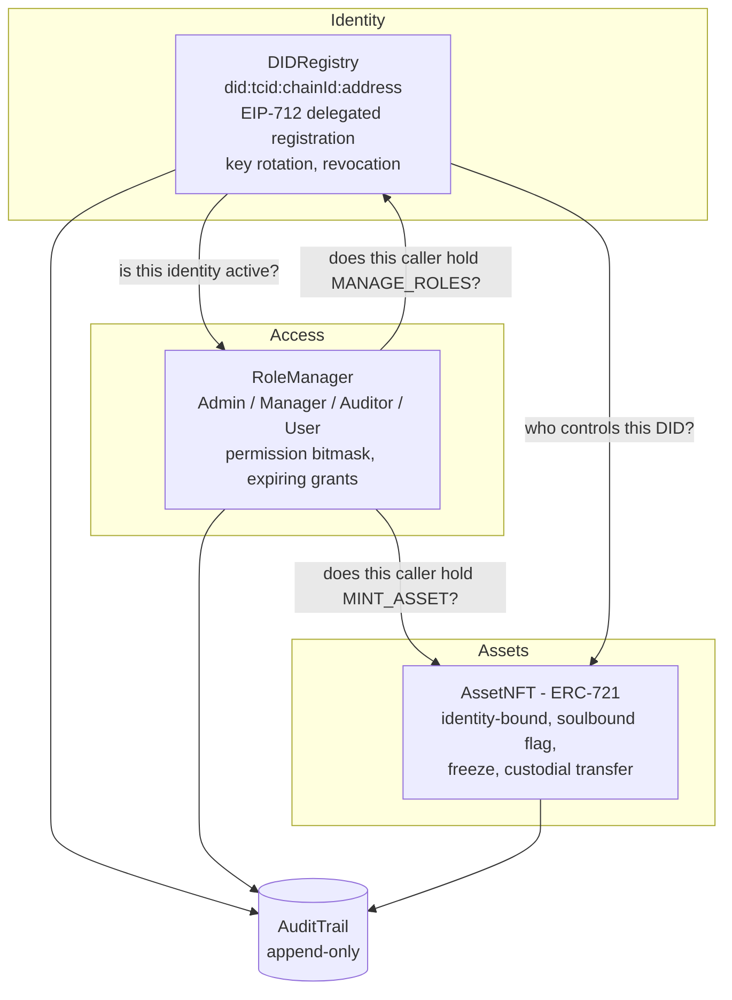

# TrustChain

A blockchain platform where **identity, access control, and asset ownership are the same
system**: every user is a decentralised identifier (DID), every permission is a role granted
to a DID, every asset is an NFT bound to a DID, and every privileged action lands in an
append-only audit trail in the same transaction that performs it.

Four Solidity contracts, 54 passing tests, a scripted end-to-end demo, and a web console
that shows the access-control rules being enforced live.

---

## Why the pieces are wired this way

Most "blockchain identity" projects bolt three separate systems together: an identity
registry, an `AccessControl` role list keyed by wallet address, and an ERC-721 collection.
The gaps between them are where the security goes:

| Gap in the naive design | What TrustChain does |
| --- | --- |
| Roles are granted to an **address**. Lose the key, lose the role; rotate the key, re-grant everything. | Roles are granted to a **DID**. `rotateController` moves the key; the roles and the assets stay with the identity. |
| Revoking a user means hunting down every role they hold. | Revoking the identity zeroes the permission mask in the same block — `permissionsOf` resolves through the DID every time, so there is no stale grant to clean up. |
| NFTs can be transferred to any address, including one with no identity behind it. | `_update` is overridden: a token can only ever land on an address controlling an active DID. This holds for `transferFrom`, `safeTransferFrom`, and operator-approved transfers alike. |
| An admin can mint an identity for someone who never asked for one. | `registerFor` requires an EIP-712 signature from the subject. The admin pays gas; the subject still consents cryptographically. |
| The audit log is written by the backend that also performs the action. | The audit entry is written *by the contract*, inside the same transaction. There is no code path that edits or deletes an entry, and only registered platform contracts can append. |

---

## Architecture



### Contracts

| Contract | Responsibility |
| --- | --- |
| [`DIDRegistry.sol`](contracts/DIDRegistry.sol) | Self-sovereign identifiers `did:tcid:<chainId>:<address>`, DID documents by URI, key rotation, permanent revocation, EIP-712 delegated registration. |
| [`RoleManager.sol`](contracts/RoleManager.sol) | RBAC bound to DIDs. Roles carry a permission bitmask; grants can expire; role hierarchy decides who may grant what. |
| [`AssetNFT.sol`](contracts/AssetNFT.sol) | ERC-721 (+ Enumerable, + URIStorage) where each token records the issuing identity, the holding identity, and a hash of the underlying document. |
| [`AuditTrail.sol`](contracts/AuditTrail.sol) | Append-only ledger of every privileged action, written by the platform contracts themselves. |

### Roles and permissions

Permissions are bits (`libraries/Permissions.sol`); a role is a mask of them, so
`permissionsOf(account)` is the union of the live roles behind that account's DID.

| Role | MANAGE_ROLES | REGISTER_IDENTITY | REVOKE_IDENTITY | MINT_ASSET | TRANSFER_ASSET | FREEZE_ASSET | BURN_ASSET | READ_AUDIT |
| --- | :-: | :-: | :-: | :-: | :-: | :-: | :-: | :-: |
| **Admin** | ✓ | ✓ | ✓ | ✓ | ✓ | ✓ | ✓ | ✓ |
| **Manager** | ✓ | ✓ | | ✓ | ✓ | ✓ | | |
| **Auditor** | | | | | | | | ✓ |
| **User** | | | | | | | | |

A Manager holds `MANAGE_ROLES` but administers only the `User` role, so a Manager can
onboard users and can never mint another Manager. Admins can add roles at runtime
(`createRole`) and change any role's mask (`setRolePermissions`), which takes effect for
every holder immediately. Grants accept an expiry — a time-boxed Auditor stops being an
Auditor without anyone remembering to revoke it.

### What the asset contract actually enforces

- Only `MINT_ASSET` can create a token, and only for an **active** identity.
- A token cannot be transferred to an address without an active identity — checked in
  `_update`, so no ERC-721 entry point bypasses it.
- `soulbound` tokens (clearances, licences, memberships) never move between identities.
- `frozen` tokens do not move until an authorised holder unfreezes them.
- `custodialTransfer` lets `TRANSFER_ASSET` move someone else's asset — a deliberate,
  audited compliance path, flagged as `custodial` in the log rather than hidden.
- `claimByIdentity` lets a rotated key pull in assets its identity still owns; because the
  identity does not change, it works for soulbound and frozen assets too.
- `verifyAuthenticity(tokenId, hash)` checks an off-chain document against the hash
  recorded at issuance.

---

## Run it

```bash
npm install
npm test
```

The scripted walkthrough — onboarding, sponsored registration, minting, every rule being
enforced, key rotation, revocation, and the resulting audit trail — runs on a throwaway
in-process chain:

```bash
npx hardhat run scripts/demo.js
```

### Web console

```bash
npx hardhat node          # terminal 1
npm run seed:local        # terminal 2 - deploys and seeds 5 identities + 3 assets
npm run web               # terminal 3 - http://127.0.0.1:5173/web/
```

Pick who you are acting as from the dropdown. The console reads your permission mask from
the chain and disables what you are not allowed to do, but the contracts are the real
guard: acting as `alice` and trying to move her soulbound clearance returns
`AssetIsSoulbound` from the chain, not a client-side warning.

### Deploying to a testnet

`scripts/deploy.js` works against any network configured in `hardhat.config.js`; add an RPC
URL and an account, then `npx hardhat run scripts/deploy.js --network <name>`. Contract
addresses are written to `deployments/<network>.json`, which is also what the web console
reads.

Deployment order matters, because the contracts verify each other: `AuditTrail` →
`DIDRegistry` (registered as a writer) → the root admin registers its own DID →
`RoleManager` (writer, then `bootstrap()`) → `DIDRegistry.setRoleManager` → `AssetNFT`
(writer). The script does this for you.

---

## Tests

```
54 passing
```

- `test/identity.test.js` — DID derivation, delegated registration (valid, forged, expired,
  unauthorised), key rotation carrying roles, revocation being permanent.
- `test/rbac.test.js` — default masks, the Manager-cannot-mint-Managers hierarchy, expiring
  grants, renouncing, permissions dying with the identity, runtime role edits.
- `test/assets.test.js` — mint authorisation, identity-gated transfers, soulbound, freeze,
  custodial transfer, claim-after-rotation, burn, authenticity verification.
- `test/audit.test.js` — ordering, actor attribution, writer-only appends, pagination, and
  the absence of any mutating entry point.

---

## Known limits

- **Governance is a single root admin.** `AuditTrail.governor` appoints writers and the
  first `ADMIN` is bootstrapped at deploy. For production that address should be a
  multisig or a timelock; the contracts already accept any address, including a contract.
- **DID documents are off-chain.** The registry stores a URI and the audit trail stores a
  hash of it. Pinning (IPFS) is out of scope here.
- **Verifiable Credentials are not implemented.** The soulbound NFT covers the
  "credential bound to an identity" case, but there is no VC issuance/presentation flow.
- **No upgradeability.** The contracts are immutable by design; a migration would mean
  redeploying and re-anchoring identities.
- **`allDids` / `getEntries` are paginated reads** meant for a UI over a modest dataset. A
  production indexer should read the events instead.
